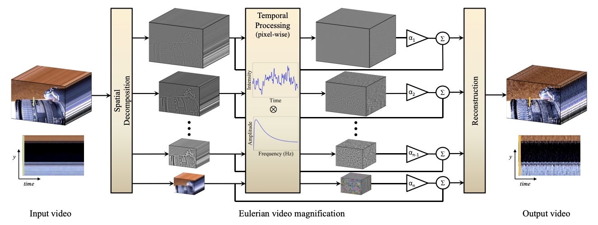

- Corresponding code and description is in [[HW2_face]](https://daheekwon.github.io/Image-generation-and-manipulation/HW2_face.html), [[HW2_baby2]](https://daheekwon.github.io/Image-generation-and-manipulation/HW2_baby2.html), [[HW2_custom]](https://daheekwon.github.io/Image-generation-and-manipulation/HW2_custom.html)
- The short video presentation link: [Video](https://youtu.be/uDeadEPJtYI)

- Above is the brief result of the homework image processing. 
  - For bayer pattern, I use "RGGB" pattern. It is because "RGGB" pattern best represents the overall tone and the contrast of colors. 
  - For white balancing, I use gray world assumption, because it remove the color cast better compared to the white world assumption.
  - So far, I've drawn the images with 5 times grown values because the image values are too small (dark) to be perceptually recognized.
  - For brightening, I scale the image with the value (maximum grayscale value * 5). I empirically choose the most approporiate value. 
  - For compression, the compression ratio of quality setting 95 is 0.177. When we compress the image with quality setting lower than 30, the image starts to corrupt. 

