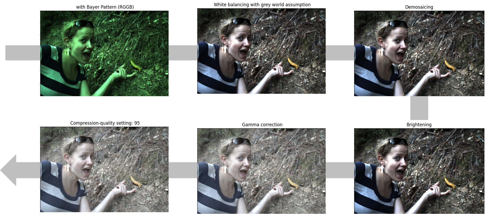

# Image-generation-and-manipulation
This is for the AI621 course Graduate school of AI @KAIST. 

## Homework 1

**Homework 1** is about image processing from linearization to gamma correction. 
- Corresponding code and description is in [HW1_code](https://github.com/daheekwon/Image-generation-and-manipulation/blob/1d4bd2dc968a1fe79c54da30ecda763eaf9fd2f9/20225421_HW1.ipynb)/ [HW1_html](https://github.com/daheekwon/Image-generation-and-manipulation/blob/21cf76874143784cb3c55c434bddd964364c7832/20225421_HW1.html).
- Above is the brief result of the homework image processing. 
  - For bayer pattern, I use "RGGB" pattern. It is because "RGGB" pattern best represents the overall tone and the contrast of colors. 
  - For white balancing, I use gray world assumption, because it remove the color cast better compared to the white world assumption. 
  - For brightening, I scale the image with the value (maximum grayscale value * 5). I empirically choose the most approporiate value. 
  - For compression, the compression ratio of quality setting 95 is 0.177. When we compress the image with quality setting lower than 30, the image starts to corrupt. 

-------------------------------------------------
## Contact
Dahee Kwon \
Ph.D student(20225421) \
Graduate school of AI @ KAIST 
